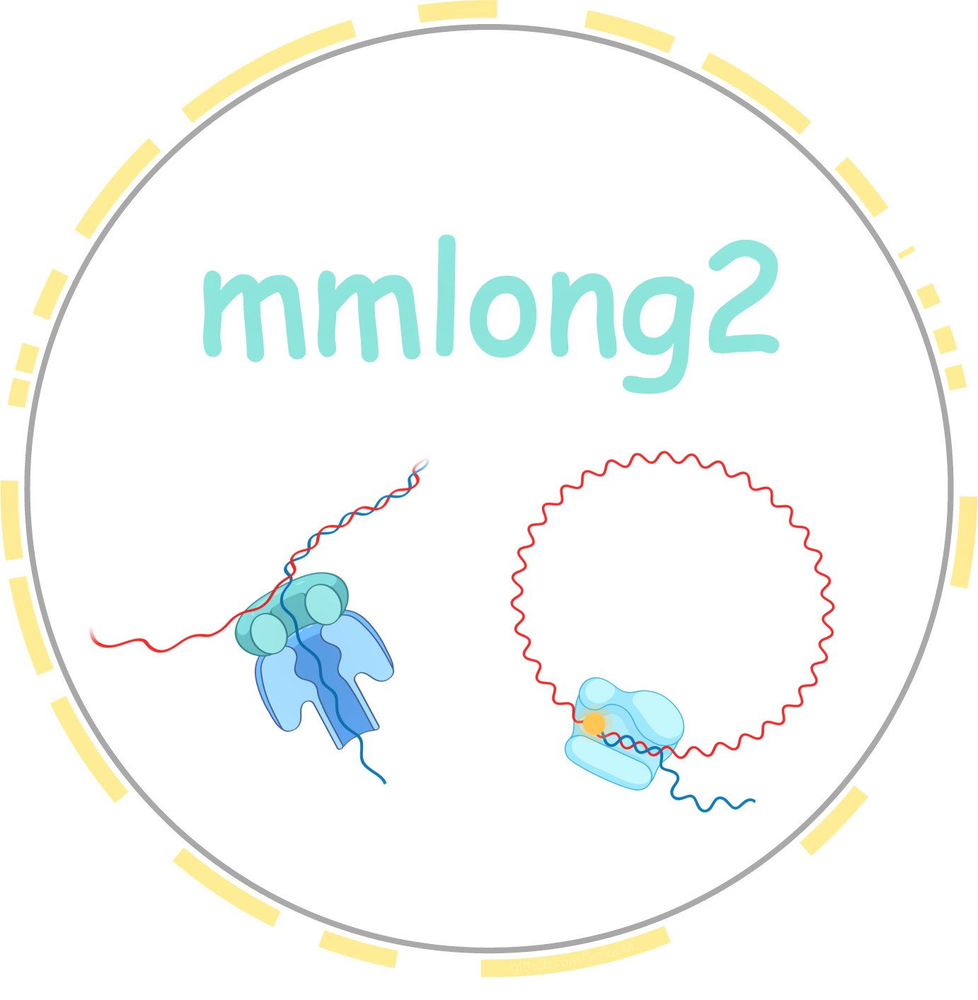
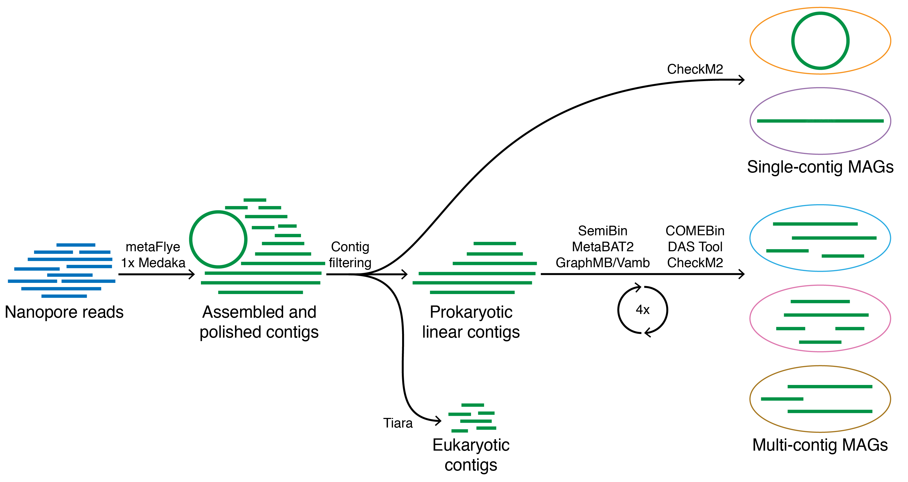

[](https://anaconda.org/bioconda/mmlong2-lite)
[](https://github.com/Serka-M/mmlong2-lite/blob/main/LICENSE)
[](https://doi.org/10.1038/s41564-025-02062-z)

<p align="center">

</p>

Lightweight workflow for microbial genome recovery using either Nanopore or PacBio HiFi reads. <br/>
mmlong2-lite is the microbial genome production part of the [mmlong2](https://github.com/Serka-M/mmlong2) pipeline.
<br/>

## Workflow description
### Core features
* [Snakemake](https://snakemake.readthedocs.io) workflow running dependencies from a [Singularity](https://docs.sylabs.io/guides/latest/user-guide/) container for enhanced reproducibility
* Bioinformatics tool and parameter optimizations for high complexity metagenomics samples
* Automated metagenomic assembly curation for identification and removal of misassemblies
* Circular microbial genome extraction as separate genome bins
* Eukaryotic contig removal for reduced microbial genome contamination
* Differential coverage support for improved microbial genome recovery
* Iterative ensemble binning strategy for improved microbial genome recovery

### Schematic overview of workflow example

<br/>

## Installation
### Bioconda
The mmlong2-lite workflow is available through [Bioconda](https://bioconda.github.io/):
```
conda create -c conda-forge -c bioconda mmlong2-lite
```

### From source (Conda) 
To create a local [Conda](https://docs.conda.io/projects/conda/en/latest/user-guide/install/linux.html) environment for running mmlong2-lite workflow, just copy-paste the following:
```
conda create --prefix mmlong2-lite -c conda-forge -c bioconda snakemake=9.9.0 singularity=3.8.6 zenodo_get=1.6.1 pv=1.6.6 pigz=2.8 tar=1.35 rsync=3.4.1 -y
conda activate ./mmlong2-lite || source activate ./mmlong2-lite 
git clone https://github.com/Serka-M/mmlong2-lite/ mmlong2-lite/repo
mv mmlong2-lite/repo/src/* mmlong2-lite/bin
chmod +x mmlong2-lite/bin/mmlong2-lite
mmlong2-lite -h 
```
After setting up the virtual environment, the required software dependencies will be automatically installed when running the workflow for the first time.
<br/>

## Running mmlong2-lite
### Usage example
```
mmlong2-lite -np nanopore_reads.fastq.gz -o output_dir -p 100
```

### Full usage
```
MAIN SETTINGS:
-np     --nanopore_reads        Path to Nanopore reads (default: none)
-pb     --pacbio_reads          Path to PacBio HiFi reads (default: none)
-o      --output_dir            Output directory name (default: mmlong2)
-p      --processes             Number of processes/multi-threading (default: 3)
-bin    --binning_mode          Run pipeline with a specified binning mode (e.g. fast default extended)
 
OPTIONAL SETTINGS:
-cov    --coverage              CSV dataframe for differential coverage binning (e.g. NP/PB/IL,/path/to/reads.fastq)
-run    --run_until             Run pipeline until a specified stage completes (e.g. assembly curation filtering singletons coverage binning)
-tmp    --temporary_dir         Directory for temporary files (default: $TMPDIR)
-fly    --use_metaflye          Use metaFlye for metagenomic assembly
-dbg    --use_metamdbg          Use metaMDBG for metagenomic assembly
-myl    --use_myloasm          	Use myloasm for metagenomic assembly
-ca     --custom_assembly       Use a custom assembly
-cai    --custom_assembly_info  Optional assembly information file (metaFlye format) for custom assembly
-med    --use_medaka            Use Medaka for polishing Nanopore assemblies (default: skip Medaka)
-mm     --medaka_model          Medaka polishing model (default: r1041_e82_400bps_sup_v5.0.0)
-scr    --skip_curation         Skip assembly curation and removal of misassemblies (default: run curation)
-who    --use_whokaryote        Use Whokaryote for identifying eukaryotic contigs (default: use Tiara)
-sem    --semibin_model         Binning model for SemiBin (default: global)
-mlc    --min_len_contig        Minimum assembly contig length (default: 3000)
-mlb    --min_len_bin           Minimum genomic bin size (default: 250000)
-scl	--skip_cleanup			Skip cleanup of workflow intermediate files
-env    --conda_envs_only       Use conda environments instead of container (default: use container)
-h      --help                  Print help information
-v      --version               Print workflow version number

ADVANCED SETTINGS:
-mmo    --myloasm_min_ovlp      Minimum overlap between reads used by myloasm assembler (default: 500)
-mmc    --myloasm_min_cov       Minimum contig coverage used by myloasm assembler (default: 1)
-fmo    --flye_min_ovlp         Minimum overlap between reads used by Flye assembler (default: auto)
-fmc    --flye_min_cov          Minimum initial contig coverage used by Flye assembler (default: 3)
-n      --dryrun                Print summary of jobs for the Snakemake workflow
-t      --touch                 Touch Snakemake output files
-r      --rule                  Run specified Snakemake rule
-x      --extra_inputs          Extra inputs for Snakemake config file
```

### Using differential coverage binning
To perform genome recovery with differential coverage, prepare a 2-column comma-separated dataframe, indicating the additional read datatype (`NP` for Nanopore, `PB` for PacBio, `IL` for short reads) and read file location.<br/>
Dataframe example:
```
PB,/path/to/your/reads/file1.fastq
NP,/path/to/your/reads/file2.fastq
IL,/path/to/your/reads/file3.fastq.gz
```
The prepared dataframe can be provided to the workflow through the `-cov` option.

### Overview of result files
* `<output_name>_assembly.fasta` - metagenome assembly file
* `<output_name>_bins.tsv` - per-bin dataframe for the recovered genomes
* `<output_name>_usage.tsv` - dataframe for compute resource usage
* `dependencies.csv`- list of dependencies used and their versions
* `bins` - directory for metagenome assembled genomes

### Additional documentation
* [Dataframe description](msc/mmlong2-lite-dfs.md)
* [Dependency list](msc/mmlong2-lite-dep.md)

## Citation
If you use mmlong2-lite in a publication, please cite:
> Sereika, M., Mussig, A.J., Jiang, C. et al. Genome-resolved long-read sequencing expands known microbial diversity across terrestrial habitats. Nat Microbiol (2025). [https://doi.org/10.1038/s41564-025-02062-z](https://doi.org/10.1038/s41564-025-02062-z)

[//]: # (Written by Mantas Sereika)
