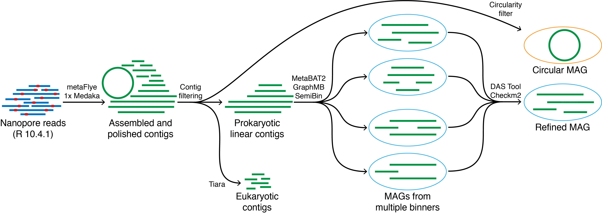

Lightweight workflow for microbial genome recovery using either Nanopore or PacBio HiFi reads.  
mmlong2-lite is the microbial genome production part of the [mmlong2](https://github.com/Serka-M/mmlong2) pipeline.  
 
 
**Core features:**
* [Snakemake](https://snakemake.readthedocs.io) workflow running dependencies from a [Singularity](https://docs.sylabs.io/guides/latest/user-guide/) container for enhanced reproducibility
* Bioinformatics tool and parameter optimizations for high complexity metagenomics samples
* Circular microbial genome extraction as separate genome bins
* Eukaryotic contig removal for reduced microbial genome contamination
* Differential coverage support for improved microbial genome recovery
* Iterative binning strategy for improved microbial genome recovery
 

**Overview of mmlong2-lite workflow in Nanopore mode:**
 

 

**Additional documentation:**
* [Dataframe description](msc/mmlong2-lite-dfs.md)
* [Dependency list](msc/mmlong2-lite-dep.md)
 
