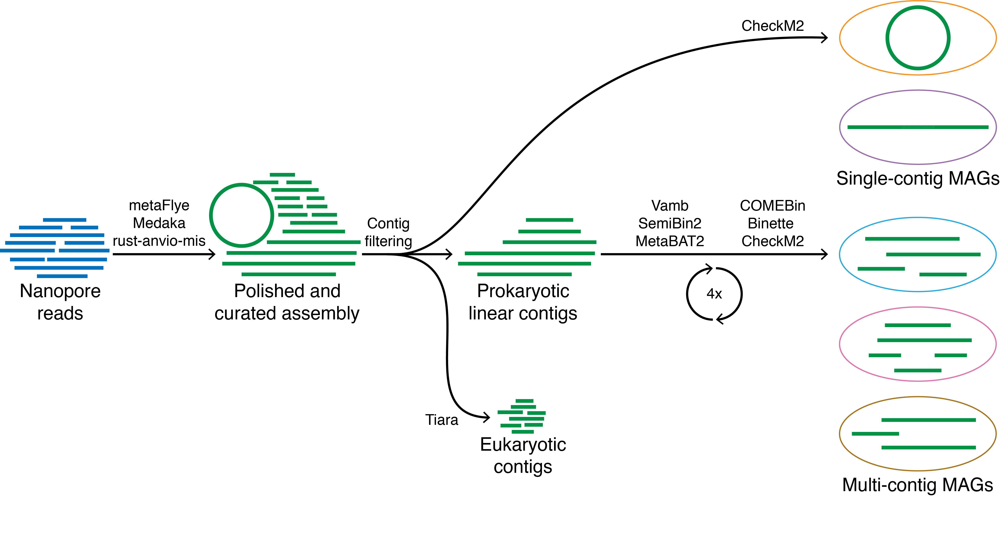

<p align="center">

</p>

Lightweight workflow for microbial genome recovery using either Nanopore or PacBio HiFi reads. <br/>
mmlong2-lite is the microbial genome production part of the [mmlong2](https://github.com/Serka-M/mmlong2) pipeline.
<br/>

### Core workflow features:
* [Snakemake](https://snakemake.readthedocs.io) workflow running dependencies from a [Singularity](https://docs.sylabs.io/guides/latest/user-guide/) container for enhanced reproducibility
* Bioinformatics tool and parameter optimizations for high complexity metagenomics samples
* Circular microbial genome extraction as separate genome bins
* Eukaryotic contig removal for reduced microbial genome contamination
* Differential coverage support for improved microbial genome recovery
* Iterative ensemble binning strategy for improved microbial genome recovery

### Overview of mmlong2-lite workflow with Nanopore reads:


### Installation (Conda): 
To create a local [Conda](https://docs.conda.io/projects/conda/en/latest/user-guide/install/linux.html) environment for running mmlong2-lite workflow, just copy-paste the following:
```
conda create --prefix mmlong2-lite -c defaults -c conda-forge -c bioconda snakemake=7.19.1 singularity=3.8.6 mamba=1.1.0 wget=1.20.3 pv=1.6.6 pigz=2.6 tar=1.34 -y
conda activate ./mmlong2-lite || source activate ./mmlong2-lite
wget https://zenodo.org/record/7558541/files/sing-mmlong2-lite.tar.gz -O mmlong2-lite/bin/sing-mmlong2-lite.tar.gz 
pv mmlong2-lite/bin/sing-mmlong2-lite.tar.gz | pigz -dc - | tar xf - -C mmlong2-lite/bin/.
```

### Full usage:
```
MAIN INPUTS:
-np     --nanopore_reads        Path to Nanopore reads (default: none)
-pb     --pacbio_reads          Path to PacBio HiFi reads (default: none)
-o      --output_dir            Output directory name (default: mmlong2_out)
-p      --processes             Number of processes/multi-threading (default: 3)
-cov    --coverage              CSV dataframe for differential coverage binning (e.g. NP/PB/IL,/path/to/reads.fastq)

ADDITIONAL INPUTS:
-tmp    --temporary_dir         Directory for temporary files (default: none)
-med    --medaka_model          Medaka polishing model (default: r1041_e82_400bps_sup_g615)
-sem    --semibin_model         Binning model for SemiBin (default: global)
-fmo    --flye_min_ovlp         Minimum overlap between reads used by Flye assembler (default: auto)
-fmc    --flye_min_cov          Minimum initial contig coverage used by Flye assembler (default: 3)
-mlc    --min_len_contig        Minimum assembly contig length (default: 3000)
-mlb    --min_len_bin           Minimum genomic bin size (default: 250000)
-x      --extra_inputs          Extra inputs for Snakemake workflow (default: none)

MISCELLANEOUS INPUTS:
-h      --help                  Print help information
-v      --version               Print workflow version number
```

### Overview of result files:
* `assembly.fasta` - assembled and polished metagenome after minimum length filtering
* `<name>_bins.tsv` - dataframe for automated binning results
* `bins` - directory for metagenome assembled genomes
* `dependencies.csv`- list of dependencies used and their versions

### Additional documentation:
* [Dataframe description](msc/mmlong2-lite-dfs.md)
* [Dependency list](msc/mmlong2-lite-dep.md)

[//]: # (Written by Mantas Sereika)
